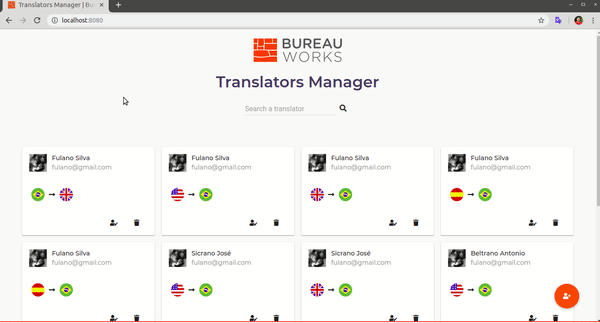
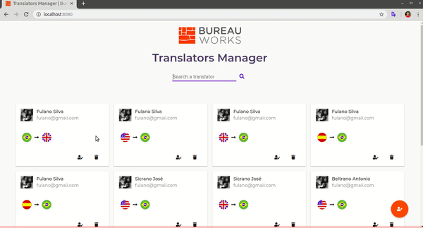
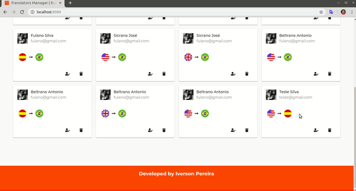
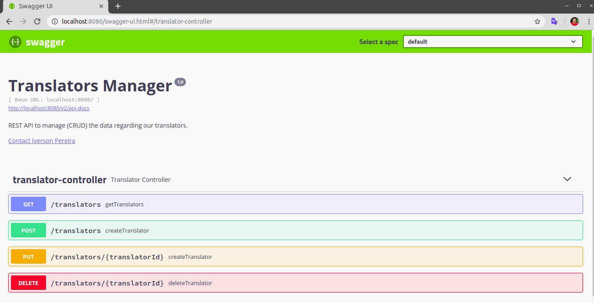

# Translators Manager
This system consists in a manager of Translators. Its possible to list, to create, to update and to delete translators.

This system works with a REST API to manage the data stored on database. This API was developed using Spring Boot and the Translators Manager (front-end) was developed using AngularJS.

### Requirements

Tested on Ubuntu 18.04

- Java 8
- PostgreSQL - https://www.postgresql.org/

#### Set up PostgreSQL

If already installed on your machine, certify yourself that you have the following username and password on your PostgreSQL. Otherwise, change the file *[application.properties](https://github.com/ilp/bw-translators-project/blob/master/src/main/resources/application.properties)* with the correct credentials or create if needed.

Properties to connect with database:
`spring.datasource.url= jdbc:postgresql://localhost:5432/postgres`

`spring.datasource.username=postgres`

`spring.datasource.password=password`

- **Username**: postgres
- **Password**: password

#### Building the application

- Run this command on terminal:

  `./gradlew build`

  Running the application:

- Access the folder *build/libs* and run this command on terminal:

  `cd build/libs`

  `java -jar translators-0.0.1-SNAPSHOT.jar`

- If the database connection is successful access http://localhost:8080.

### Understanding Translators Manager

Bellow some images with the features of this application.

In this image is possible to see how to filter translator by name, email, language.

To create a new translator just to click on floating button to open the dialog and to filling the fields.

To edit or delete is just to click on the buttons present in each card.

### Testing the CRUD with Swagger

Access <http://localhost:8080/swagger-ui.html>

